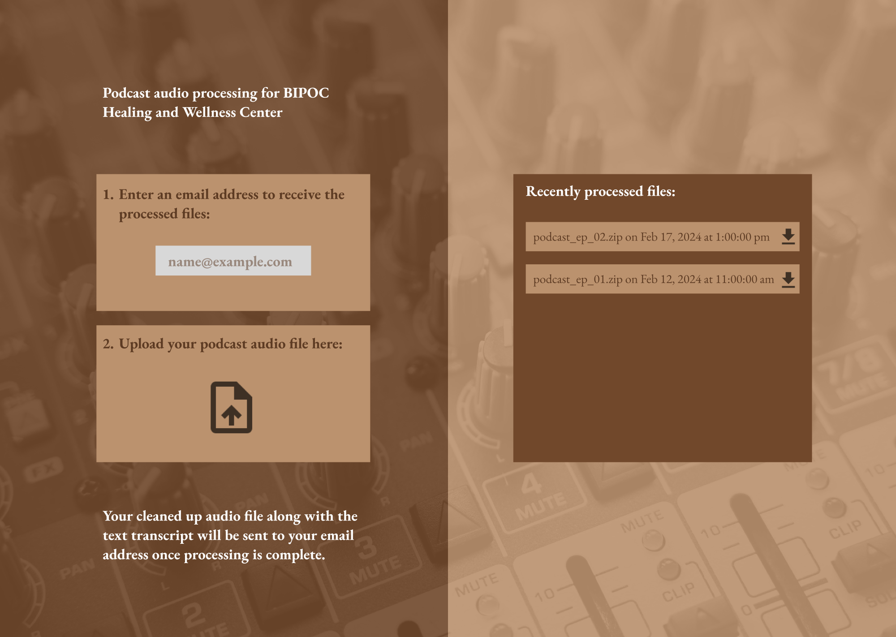
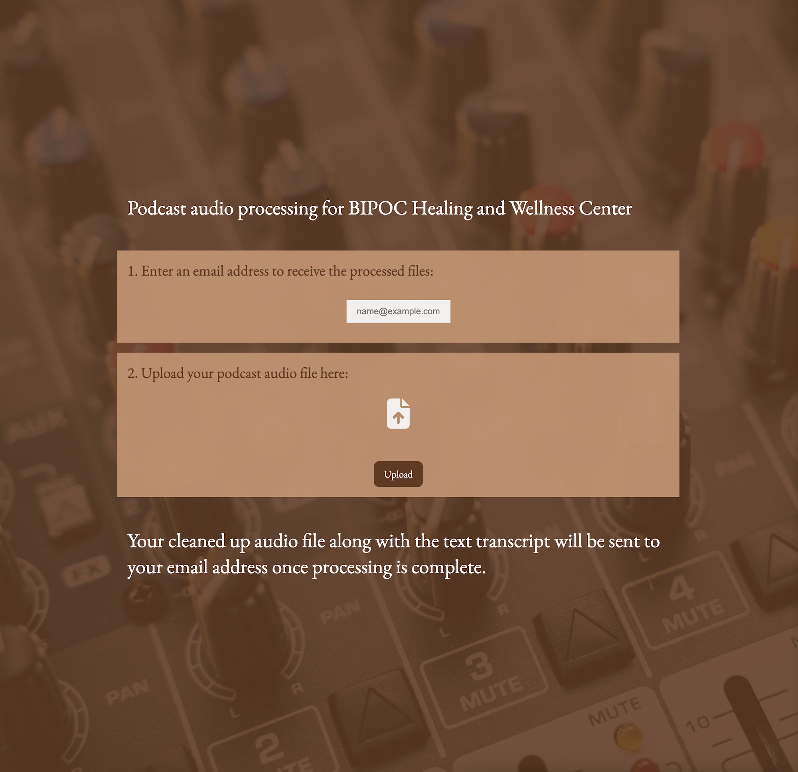

# Welcome to Audie

Upload your podcast audio file to have it edited, transcribed, and emailed to you all with one click!

## About This Project

Audie is a project idea pitched as a volunteer effort for the [BIPOC Healing and Wellness Centre](https://www.bipochealingcentre.ca/) in order to simplify and expedite their podcast episode editing process.

Audie works by uploading an audio file to your own AWS S3 bucket, sending that uploaded file to [Cleanvoice](https://cleanvoice.ai/) for processing, and then emailing you a link where the processed audio file and transcript will be available.

Technology stack: Next.js, React, TypeScript, AWS S3, SendGrid, Cleanvoice.

### Mockup Design

Created in [Figma by me.](https://www.figma.com/design/3fqwblQpQQMpqZr0nrJ1fj/Untitled?node-id=0-1&t=P9v4u2tI77rqY0yL-1)

### Project Screenshot

Taken from the current state of the project.

## Project Status

This project is incomplete as there is one last issue with the processing of the audio file on Cleanvoice. This is most likely due to how Cleanvoice processes files hosted on external S3 buckets. This is what currently happens:

Upon configuring all the API Keys and other variables in your own`.env.local` file, you will be able to upload an audio file to AWS S3, have that file sent to Cleanvoice, and then have that Cleanvoice link emailed to you.

The Cleanvoice link that gets emailed is valid, but nothing appears on the page.

### Learnings

I started this project by working on the file upload feature first, which I now see as a mistake due to the complications with Cleanvoice handling external S3 files. If I were to start over, I would start directly with the Cleanvoice docs since they have their own upload process which could have saved me the time configuring my own S3 bucket and integrating the native AWS workflow.

I still feel that this was a good project to get some practice with Next.js, React, and TypeScript. I definitely grew an appreciation for how cleanly you can set up routing with Next.js and organize components with React.

## How To Use

### Running the app

1. Setup an AWS S3 bucket according to the [Next.js + AWS S3 Upload section of this README.](#nextjs--aws-s3-upload)

1. Obtain an API Key for Cleanvoice by creating an account [here.](https://cleanvoice.ai/)

1. Obtain an API Key and setup a sender email with SendGrid [here.](https://sendgrid.com/en-us)

1. Create a file in the project root directoy called `.env.local` and fill in the values from the `.env.example` file there.

1. Run the development server:
	
	```bash
	npm run dev
	# or
	yarn dev
	# or
	pnpm dev
	# or
	bun dev
	```
	
1. Open [http://localhost:3000](http://localhost:3000) with your browser.

1. Choose an audio file and click the Upload button.

1. You should see a confirmation message.

1. Check your email for a link to the processed file.

### Troubleshooting

Make sure your S3 bucket is configured exactly according to the steps in this README.

Ensure your audio file is below the size limit set in the `content-length-range` setting in `/app/api/upload/route.ts`

# Next.js + AWS S3 Upload

**Option 1: Use an existing S3 bucket.**

Retrieve your existing access key, secret key, S3 bucket region and name. Provide those values after clicking "Deploy" to automatically set the environment variables.

[](https://vercel.com/new/clone?repository-url=https://github.com/vercel/examples/tree/main/solutions/aws-s3-image-upload&project-name=aws-s3-image-upload&repository-name=aws-s3-image-upload&env=AWS_ACCESS_KEY_ID,AWS_SECRET_ACCESS_KEY,AWS_REGION,BUCKET_NAME)

**Option 2: Create an S3 bucket.**

1. Create a new [S3 Bucket](https://console.aws.amazon.com/s3/).
   1. In Object Ownership, select "ACLs enabled" and "Bucket owner prefered"
   1. In Block Public Access settings for this bucket, uncheck "Block all public access".
1. Create a new [IAM User](https://aws.amazon.com/iam/).
   1. Select "Attach policies directly".
   1. Add `s3:DeleteObject`, `s3:GetObject`, `s3:ListBucket`, `s3:PutObject`, `s3:PutObjectAcl`
1. Save the access key and secret key for the IAM User.
   1. Select the newly created user (IAM > Users > "your-user") and navigate to "Security Credentials".
   1. Under "Access Keys", create a key and save this information. We will use this in the next step.
1. Create an `.env.local` file similar to `.env.example`.
   1. In your `env.local` file, use the information from your access key, along with the region and bucket name.
   1. Do not adjust the naming of the keys, only input your values. [This is to ensure S3 Client can read them as defaults](https://docs.aws.amazon.com/sdkref/latest/guide/settings-reference.html).
1. Configure CORS to enable uploads from your browser.
   1. Navigate to your bucket, and go to the "Permissions" tab.
   1. Scroll down to find "Cross-origin resource sharing (CORS)" and click "Edit" on the right side.
   
   ```
   [
    {
        "AllowedHeaders": [
            "*"
        ],
        "AllowedMethods": [
            "GET",
            "PUT",
            "POST",
            "DELETE"
        ],
        "AllowedOrigins": [
            "*"
        ],
        "ExposeHeaders": []
    }
   ]
   ```

This example uses [`createPresignedPost`](https://docs.aws.amazon.com/AWSJavaScriptSDK/latest/AWS/S3.html#createPresignedPost-property) instead of [`getSignedUrlPromise`](https://docs.aws.amazon.com/AWSJavaScriptSDK/latest/AWS/S3.html#getSignedUrlPromise-property) to allow setting max/min file sizes with `content-length-range`.

Deploy it to the cloud with [Vercel](https://vercel.com/new?utm_source=github&utm_medium=readme&utm_campaign=edge-middleware-eap) ([Documentation](https://nextjs.org/docs/deployment)).

## Credentials and Environment Variables

AWS credentials (e.g. `AWS_ACCESS_KEY_ID` and `AWS_SECRET_ACCESS_KEY`) and region configuration (e.g. `AWS_REGION`) can now be used directly as environment variables for Vercel deployments.

These variables are the default names expected by the AWS SDK, which means the user no longer has to configure credentials when using it. For example, this code is no longer necessary:

```js
const s3 = new S3Client({
  accessKeyId: process.env.ACCESS_KEY,
  secretAccessKey: process.env.SECRET_ACCESS_KEY,
  region: process.env.REGION,
})
```

Instead, it can be replaced with this:

```
const client = new S3Client({ region: process.env.AWS_REGION });
```

[Source: AWS Environment Variable Default “Load Credential”](https://docs.aws.amazon.com/sdk-for-java/v1/developer-guide/credentials.html)

The SDK will pick up the credentials from the environment automatically.

## Additional Resources

### AWS Environment Variables

- AWS Environment Variables: https://docs.aws.amazon.com/sdkref/latest/guide/settings-reference.html
- AWS Environment Variable Default “Load Credential”: https://docs.aws.amazon.com/sdk-for-java/v1/developer-guide/credentials.html

### AWS SDK - Presigned Post

- How to use PresignedPost URLs (this example includes adding user id as metadata): https://advancedweb.hu/how-to-use-s3-post-signed-urls/
- AWS SDK v3 - S3Client Initalization (see Usage): https://docs.aws.amazon.com/AWSJavaScriptSDK/v3/latest/clients/client-s3/index.html
- AWS SDK - Generate a Presigned Post: https://docs.aws.amazon.com/AWSJavaScriptSDK/v3/latest/modules/_aws_sdk_s3_presigned_post.html#generate-a-presigned-post
- AWS S3 POST Policy - Condition Matching (only allow images): https://docs.aws.amazon.com/AmazonS3/latest/API/sigv4-HTTPPOSTConstructPolicy.html
- AWS ACL Permissions: https://stackoverflow.com/a/70550540/19416953
